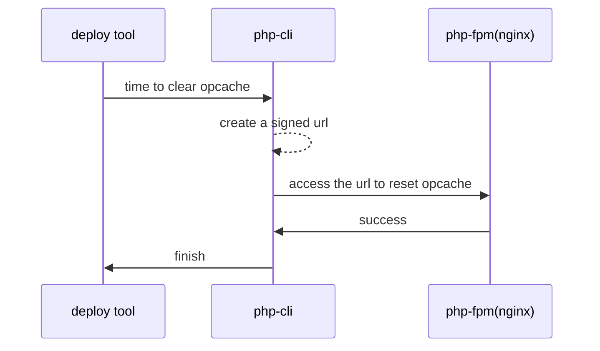

# laravel-opcache-manager

[中文文档](./README_zh.md)

opcache manager for laravel

give a command `opcache-manager:clear` to reset opcache of web server from cli, more auto, more simple

## workflow

I am using [php deployer](https://deployer.org/),so just add a task `opcache:reset` after `deploy` to clear opcache. The workflow is like this . Also you should be able to use it in other deployment solution

## todo

- [ ] a manager api/view to get opcache status
