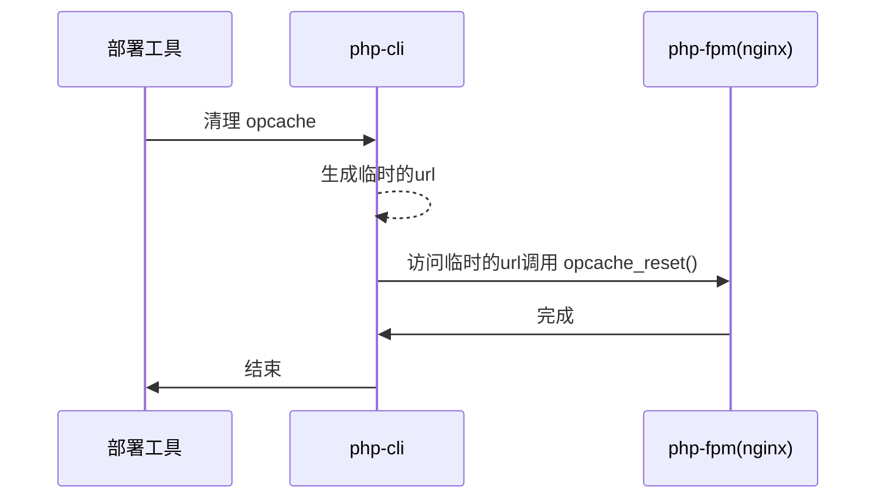

# laravel-opcache-manager

laravel opcache 管理工具

使用命令 `opcache-manager:clear` 重启 web 服务器 opcache

## 工作流程

个人使用[php deployer](https://deployer.org/),所以在 `deploy` task 后执行`opcache:reset` 就可以. 当然你也可以在其他部署工具/方案里面使用.

